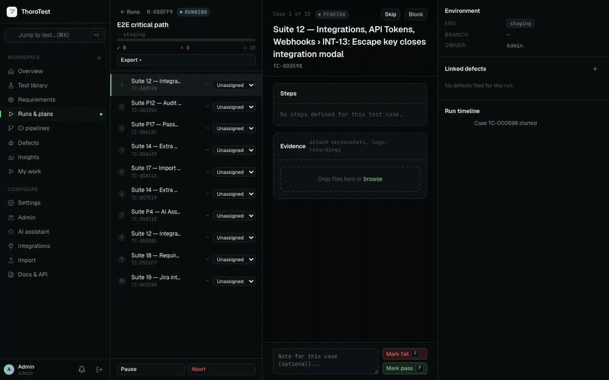
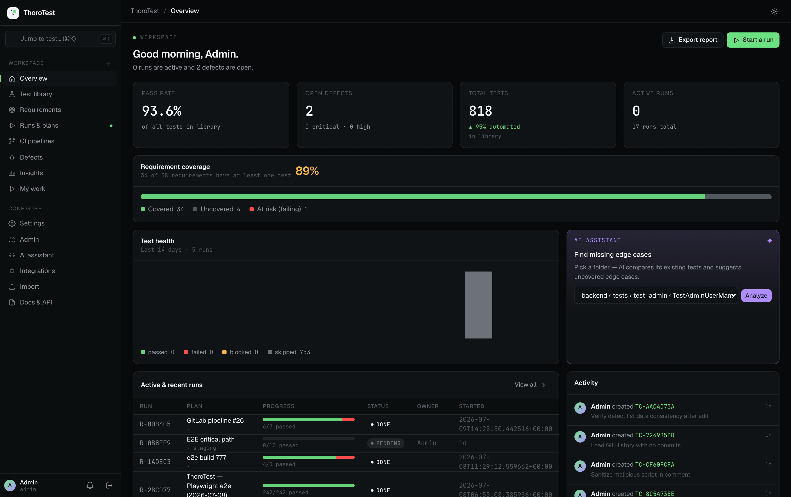
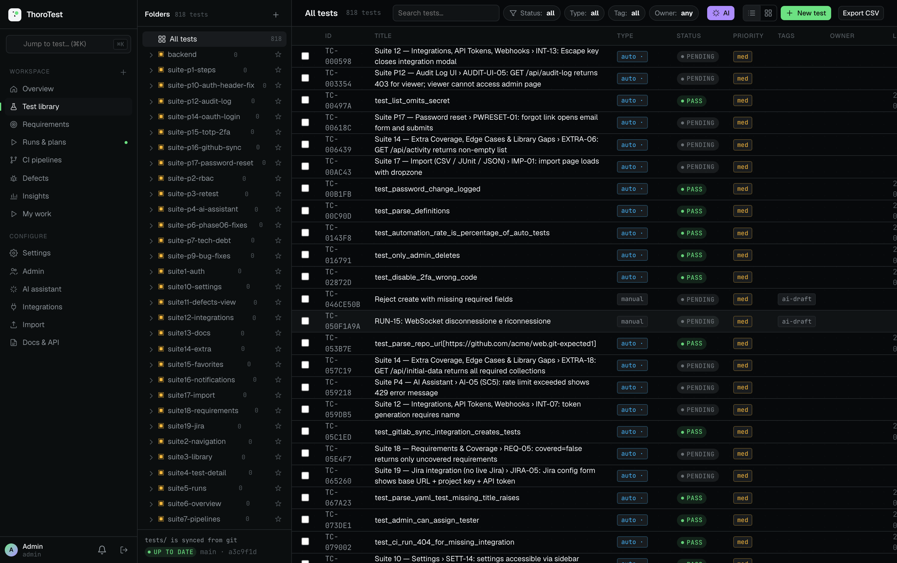

# ThoroTest

> **Self-hosted test management that treats manual and automated tests as one timeline.** Organize, run, and track every test — trace features, stories, and epics to the tests that cover them, and see coverage at a glance.

[](package.json)
[](LICENSE)
[](#tests)
[](#stack)
[](#stack)
[](#quickstart)

<p align="center">
  
  <br><sub><i>Live run: automated results stream in over WebSocket — cases flip to pass/fail in real time.</i></sub>
</p>

<p align="center">
  
  
</p>

---

## Contents

[Why](#why-thorotest) · [Features](#features) · [Stack](#stack) · [Quickstart](#quickstart) · [Quick example](#quick-example) · [Tests as Code](#tests-as-code-github--gitlab-sync) · [Jira](#jira-integration) · [Requirements](#requirements--coverage) · [Import](#test-import) · [CI](#ci-run-pipelines-and-import-results) · [Docs](#documentation) · [Roadmap](#roadmap) · [License](#license)

---

## Why ThoroTest

Most test management lives in **closed, per-seat SaaS** (TestRail, Zephyr, Xray) or **dated open-source** (TestLink, Kiwi TCMS). ThoroTest is source-available, self-hostable, and built around one idea the others split apart: **manual and automated results share one timeline**.

| | ThoroTest | TestRail / Zephyr / Xray | TestLink / Kiwi |
|---|---|---|---|
| **Hosting** | Self-host, airgap-capable | Closed SaaS (or pricey server tier) | Self-host |
| **Cost** | Free (source-available) | Per-seat subscription | Free |
| **Manual + automated** | One unified timeline | Separate, or Jira add-on | Manual-first |
| **Migrate in** | 9 importers, auto-detect (TestRail, Zephyr, Xray, qTest, TestLink, JUnit, Allure, CSV/XLSX) | — | Limited |
| **Tests as code** | Two-way Git sync (GitHub + GitLab YAML) | — | — |
| **CI native** | Trigger + import GitHub Actions / GitLab CI | Import only | — |
| **API** | REST **+** GraphQL + API tokens + HMAC webhooks | REST | Limited |
| **AI assistant** | Built-in, BYOK (Claude or any OpenAI-compatible / local LLM) | Add-on | — |
| **Stack** | Modern (FastAPI + React 18) | Varies | Legacy PHP |

Already on TestRail/Zephyr/Xray? The import pipeline is built for **migrating off them** — upload the native export, preview, import. Re-imports are idempotent (matched by source id), so you can sync repeatedly during a cutover.

---

## Features

- **Unified runs** — manual case execution and automated CI results in one run history.
- **Requirements & coverage** — link features/stories/epics to tests; per-requirement and workspace coverage bars, uncovered/at-risk surfacing.
- **Tests as code** — two-way YAML sync with GitHub & GitLab (pull to create tests, push to commit back, 409 conflict guard).
- **CI integration** — dispatch GitHub Actions / GitLab CI pipelines from the app, auto-import JUnit results, link them to the originating test.
- **Migrate anything** — 9 auto-detected importers with preview and dedup.
- **Jira two-way** — pull stories→requirements, push defects→bugs.
- **Full auth stack** — JWT, RBAC, TOTP 2FA, GitHub/Google OAuth, audit log, API tokens, HMAC webhooks.
- **Self-contained** — React, fonts, all assets served locally; zero external requests, works airgapped.
- **BYOK AI assistant** — edge-case generation etc. via Claude or any OpenAI-compatible / local LLM. Off unless a key is set.
- **i18n** — en / it / de / es / fr.

---

## Stack

| Layer | Tech |
|---|---|
| Frontend | React 18 (vendored production UMD), JSX transpiled + minified by esbuild at build time |
| Backend | FastAPI, SQLAlchemy |
| Database | SQLite (default) · PostgreSQL · MySQL / MariaDB (via `DATABASE_URL`) |
| Realtime | WebSocket (native FastAPI) |
| API | REST + GraphQL (Strawberry) |
| Auth | JWT (python-jose), passlib (sha256_crypt) |
| AI | Anthropic SDK (BYOK — optional) |
| Export | PDF (fpdf2), CSV |
| Tests | pytest, httpx, Playwright |
| Deploy | Docker + docker-compose |

Fully self-contained: React, fonts, and all assets are served locally — no CDN or external requests, works airgapped. `npm run build` produces `frontend/dist/` (run automatically by `make dev`, `install.sh`, and the Docker build).

---

## Quickstart

### Local (SQLite, no Docker)

```bash
bash install.sh  # create venv, install deps, copy .env.example → .env
make dev         # start server → http://localhost:8000
make open        # open app in browser
```

### Docker + PostgreSQL

```bash
cp .env.example .env   # edit SECRET_KEY before production
make docker-up         # build image + start app and Postgres
make open
```

### Docker + SQLite

```bash
cp .env.example .env
make docker-up-sqlite
```

Database is created automatically on first run. Seed data: 19 test cases across 12 folders, 11 runs, 9 defects. Pipelines are not seeded — the page fills from real CI runs (Configure ▸ Integrations ▸ Run CI).

First login uses the seeded admin — `admin@localhost` / `admin` (change it immediately).

---

## Quick example

Define a test as YAML in your Git repo, sync it, and let a real CI run flip its status — status lives in the run, never hand-written:

```yaml
# tests/checkout/card-charge.yml
id: TC-2301
title: "Stripe card charge succeeds on test card"
type: automated
runner: playwright
priority: high
tags: [smoke, payment]
folder: Checkout/Payment
```

```text
Settings ▸ Integrations ▸ Add ▸ GitHub → Sync
   → creates test TC-2301 (status: pending)
Integrations ▸ Run CI (GitHub Actions / GitLab CI)
   → runs the pipeline, imports the JUnit artifact
   → result links back to TC-2301 and flips it to pass / fail
```

Prefer the API? Everything the UI does is REST (and GraphQL):

```console
# login → token
TOKEN=$(curl -s localhost:8000/api/auth/login \
  -H 'Content-Type: application/json' \
  -d '{"email":"admin@localhost","password":"admin"}' | jq -r .access_token)

# list tests (paginated; total in X-Total-Count header)
curl -s localhost:8000/api/tests -H "Authorization: Bearer $TOKEN" | jq '.[0]'

# same data over GraphQL
curl -s localhost:8000/graphql -H "Authorization: Bearer $TOKEN" \
  -H 'Content-Type: application/json' \
  -d '{"query":"{ tests(limit:5){ id title status } }"}'
```

---

## Setup & configuration

- **All `make` targets** — [docs/configuration.md](docs/configuration.md#make-commands).
- **Environment variables** (`.env`: database URLs, secrets, SMTP, OAuth, AI provider) — [docs/configuration.md](docs/configuration.md#environment-variables).
- **Backups** — [BACKUP.md](BACKUP.md).

---

## Tests as Code (GitHub + GitLab sync)

Keep tests defined as YAML in a Git repo and mirror them into ThoroTest. Works with **GitHub** (`github.com`) and **GitLab** (`gitlab.com` or self-hosted). The test-detail page shows the real file path, synced commit, raw YAML, and a link to the exact file at that commit.

Sync is **two-way**:

- **Pull** (Git → ThoroTest): reads the YAML schede and creates/updates tests.
- **Push** (ThoroTest → Git): the test-detail YAML card has a **Push to git** button that commits the test's current state back to its source file. A conflict guard returns **409** if the file changed on Git since the last sync — re-sync first so you don't overwrite a change made on Git.

### Setup

1. **Settings → Integrations → Add → GitHub** (or **GitLab**)
2. Fill in:
   - **Repository URL** — `https://github.com/acme/web` or `https://gitlab.com/acme/web`
   - **Provider** — `github` / `gitlab`. Inferred from the host for the public clouds; **required** for self-hosted GitLab (any other host).
   - **API base** _(GitLab only, optional)_ — e.g. `http://gitlab.internal/api/v4`; derived from the repo URL when omitted.
   - **Branch** — e.g. `main`
   - **Path** — folder holding the YAML tests, e.g. `tests/`
   - **Personal access token** — needed for private repos and for **Push to git** (GitHub `contents: write`, GitLab `api`). Stored in the integration config; never returned to clients (the API reports only `token_set: true`).
3. Click **Sync** on the integration row. ThoroTest reads every `*.yml` / `*.yaml` under the path at the latest commit, then creates/updates the matching tests and caches the file contents + commit sha.

Re-syncing is idempotent: tests are matched by their YAML `id` (or, when absent, by repo + file path), so a second sync updates in place instead of duplicating.

### YAML test format

```yaml
id: TC-2301                       # stable id, reused as the test's primary key (optional)
title: "Stripe card charge succeeds on test card"
type: automated                   # automated | manual  (aliases: e2e/auto/unit → automated)
runner: playwright
priority: high                    # low | med | high | critical  (aliases: P0–P3)
owner: anna@example.com
tags: [smoke, payment]
folder: Checkout/Payment          # "/"-separated folder hierarchy, auto-created
```

Only `title` is required. Malformed files are skipped and reported in the sync result (`warnings`), not fatal.

**Status is not a YAML field.** A test's status is owned by real CI run results, not a hand-written value, so sync never reads a `status:` from the file and push never writes one back. See **[CI status link](#linking-schede-to-ci-results)** below for how run results flow onto the scheda.

### Endpoints

- `POST /api/integrations/{id}/sync` (admin/manager) → `{ created, updated, skipped, commit, files, warnings, last_sync }`. Routes to GitHub or GitLab by the integration's provider.
- `POST /api/tests/{id}/push-to-git` (admin/manager) → `{ ok, committed, commit, path, branch }`. **409** when the file diverged on Git; **400** when the test has no Git source or no integration matches its repo.

---

## Jira integration

Two-way link with Jira Cloud, sharing one `jira` integration
(**Settings → Integrations → Add → Jira**). Config: `base_url`, `email`,
`api_token`, `project_key`, and the bug issue type.

- **Pull** (inbound): **Sync** runs a JQL query (`project = KEY AND issuetype in
  (Story, Epic)`) and upserts matching issues as requirements — matched by
  `external_key`, with Jira status/issuetype mapped to requirement status/type. Local
  test links are preserved across re-syncs.
- **Push** (outbound): on the Defects view, **Push to Jira** creates a bug from a defect
  (`POST /api/defects/{id}/push`, admin/manager) and stores the issue key + URL on the
  defect. Re-pushing a linked defect is rejected (409).

Both reuse the `external_provider` / `external_key` / `external_url` fields shipped in
v1.1 on Requirement and Defect — no schema change.

**Auto-sync (optional):** set `JIRA_AUTOSYNC_MINUTES` > 0 to have the backend pull every
Jira integration on that interval — no manual Sync needed. Per-integration failures are
logged and skipped, so one misconfigured integration can't stall the others. Off by
default (`0`); needs outbound reachability to Jira Cloud (works self-hosted, no public
endpoint required, unlike an inbound webhook).

**Security:** `api_token` is stored in the integration config and **never returned to
clients** — the API reports only `api_token_set: true`, and a blank value on edit keeps
the stored secret (same handling as the GitHub PAT). `base_url` must be `https`. The push
endpoint publishes the defect title/description to Jira and is admin/manager only.

---

## Requirements & coverage

Track features, stories, and epics as **requirements**, and link each to the tests that
verify it. The Requirements view shows a coverage bar per requirement (passed / failed /
untested) and the Overview surfaces a workspace-wide coverage summary — including
**uncovered** requirements and those **at risk** (with a failing linked test). Each test's
detail page lists the requirements it covers.

Requirements carry `external_provider` / `external_key` / `external_url` fields so they can
later be linked to an external tracker (e.g. Jira) — the same fields exist on defects.

### Bulk import

`POST /api/requirements/import` accepts a YAML, JSON, or CSV file and upserts requirements
(matched by `id`, else by `title`). Linked tests are matched by id; unknown ids are
reported as `warnings` rather than failing the import.

```yaml
- id: REQ-103                 # optional stable id (generated if absent)
  title: "Checkout — card payments"
  type: feature               # feature | story | epic
  status: active              # draft | active | done | deprecated
  priority: high              # low | med | high | critical
  owner: luca@example.com
  tests: [TC-2301, TC-2302]   # linked test ids (CSV: space/comma separated)
```

---

## Test import

Bring existing test cases — and, where the source has them, run results — in from other
test-management tools. Upload a file (the format is **auto-detected**), **preview** the
parsed counts and a sample before anything is written, then run the import and choose how
duplicates are handled.

| Source | Format | Notes |
|---|---|---|
| TestRail | XML · CSV | Native export; nested sections → folders |
| TestLink | XML | Nested `<testsuite>` → folders; importance/execution_type mapped |
| Zephyr Scale (TM4J) | JSON | Test cases + executions → runs (per cycle) |
| Xray (for Jira) | JSON | Test definitions **and** execution results (results link by issue key) |
| qTest | JSON | `properties` array flattened; `pid` as identity |
| JUnit | XML | Automated results → a run with pass/fail/skip |
| Allure | JSON | Results array → a run |
| Excel | `.xlsx` | First worksheet, via column mapping |
| Azure Test Plans / generic | CSV · XLSX | Column mapping (auto-detected aliases, overridable in the UI) |

**Matching & de-duplication.** Imported tests store `external_provider` / `external_key`
(the source tool and its case id). A re-import matches on that identity — updating or
skipping rather than duplicating — so re-running the same export is idempotent, and
same-titled cases in **different folders** stay distinct. Runs de-dupe on the source
cycle/execution id; defects on `(external_provider, external_key)`. For sources without a
stable id, matching falls back to `(title, folder)`.

**Endpoints** (`admin` / `manager` / `tester`; 10 MB max):

- `POST /api/import/detect` — detected format (+ column headers for spreadsheets)
- `POST /api/import/preview` — parsed counts and a sample, **no writes**
- `POST /api/import/execute` — persist; `conflict` = `skip` | `overwrite` | `rename`

---

## CI: run pipelines and import results

Trigger a project's pipeline from ThoroTest and import its results automatically
when the run finishes (Configure ▸ Integrations ▸ **Run CI**). Both providers are
supported:

- **GitHub Actions** — dispatch a `workflow_dispatch` workflow, then download and
  import its JUnit artifact. See **[docs/github-actions-ci.md](docs/github-actions-ci.md)**
  for workflow requirements, token setup, and API usage.
- **GitLab CI** — create a pipeline, poll it, and import its `test_report`
  (jobs just need `artifacts: reports: junit:`). See **[docs/gitlab-ci.md](docs/gitlab-ci.md)**;
  a local, dockerised demo lives in **[demo/gitlab/](demo/gitlab/)**.

Each dispatch also appears on the **Pipelines** page (running → pass/fail, with
commit, branch, and duration) — not only as an imported Run.

### Linking schede to CI results

A CI run's results are attached to the **same** test row the YAML scheda created
(no duplicate), and the scheda's status is advanced to the real run result. The
link is a correlation id: put the scheda's `id` in the automated test's name (or
class), e.g. a Playwright title `login with valid credentials [TC-GL-100]` or a
trailing `..._TC_GL_100`. On import, ThoroTest extracts that `TC-…` token and
matches it to the scheda. Tests without a token still import as their own
automated tests, so tagging is opt-in.

So the full loop is: **Sync** creates schede (status `pending`) → **Run CI** runs
the real pipeline → results link back and flip the schede to `pass`/`fail`. Status
lives in one place (the run), never in the YAML.

---

## Documentation

| Topic | Doc |
|---|---|
| Configuration, `make` commands, AI provider setup | [docs/configuration.md](docs/configuration.md) |
| Architecture, project structure, dev workflow | [docs/architecture.md](docs/architecture.md) |
| REST + GraphQL + WebSocket API, test layout | [docs/api.md](docs/api.md) |
| GitHub Actions CI setup | [docs/github-actions-ci.md](docs/github-actions-ci.md) |
| GitLab CI setup | [docs/gitlab-ci.md](docs/gitlab-ci.md) |
| Backup & restore | [BACKUP.md](BACKUP.md) |
| Full production roadmap | [PRODUCTION_ROADMAP.md](PRODUCTION_ROADMAP.md) |

---

## Tests

**576 backend unit tests** (pytest) + **31 Playwright e2e suites** covering every major flow — CI-gated.

```bash
make test        # backend unit tests
make test-e2e    # Playwright e2e (needs `make dev` running)
```

Full test layout and the live GitLab integration test → [docs/api.md#tests](docs/api.md#tests).

---

## Roadmap

All 7 production-readiness items are **done** (v1.0), and post-v1 features shipped through **v1.7**. Full detail and rationale in **[PRODUCTION_ROADMAP.md](PRODUCTION_ROADMAP.md)**.

### Shipped

- ✅ v1.0 — production hardening: gated demo simulation, esbuild frontend build (airgap-ready), pagination, `/health` + logging, password reset + SMTP, Alembic migrations, backup/restore docs.
- ✅ v1.1 — Requirements & test coverage (+ GraphQL).
- ✅ v1.2 — Jira two-way integration.
- ✅ v1.3 — External importers (TestRail/TestLink/qTest/Xray/Zephyr/XLSX) + dedup.
- ✅ v1.4 — Test Plans, realtime runs over WebSocket, API tokens, pipeline ingest, GitHub Actions CI.
- ✅ v1.5–1.7 — GitLab CI, Tests-as-Code push, TOTP 2FA, OAuth, audit log, AI edge-case assistant.

### Planned

- ⏳ UI pagination controls ("showing N of M") using `X-Total-Count`.
- ⏳ S3 attachment storage; Prometheus metrics endpoint.
- ⏳ Redis-backed rate limiter / WS state (multi-worker).
- ⏳ SSO / SAML / SCIM.

Have a request? [Open an issue](https://github.com/ecamuto/thorotest/issues).

---

## License

**ThoroTest** is source-available under the **MIT License + [Commons Clause](https://commonsclause.com/)**. See [LICENSE](LICENSE).

- **Allowed:** private and commercial use, modification, redistribution, internal/company use.
- **Not allowed:** selling the software as a product or service — including cloud/SaaS hosting or consulting/support businesses whose value derives substantially from ThoroTest.

Note: Commons Clause makes this *source-available*, not OSI open source.
